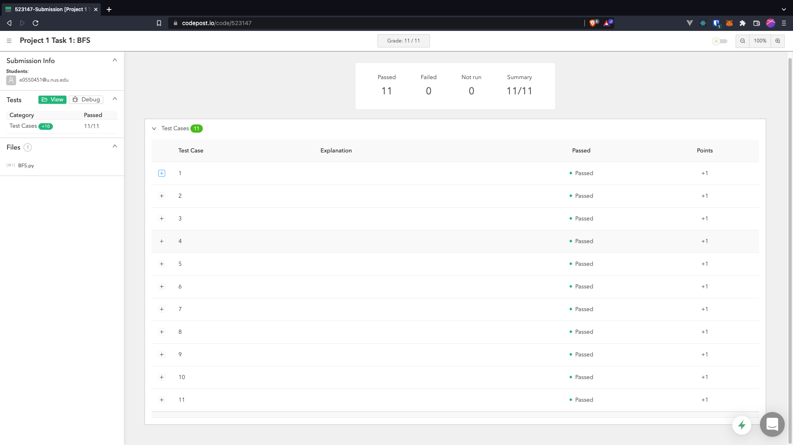
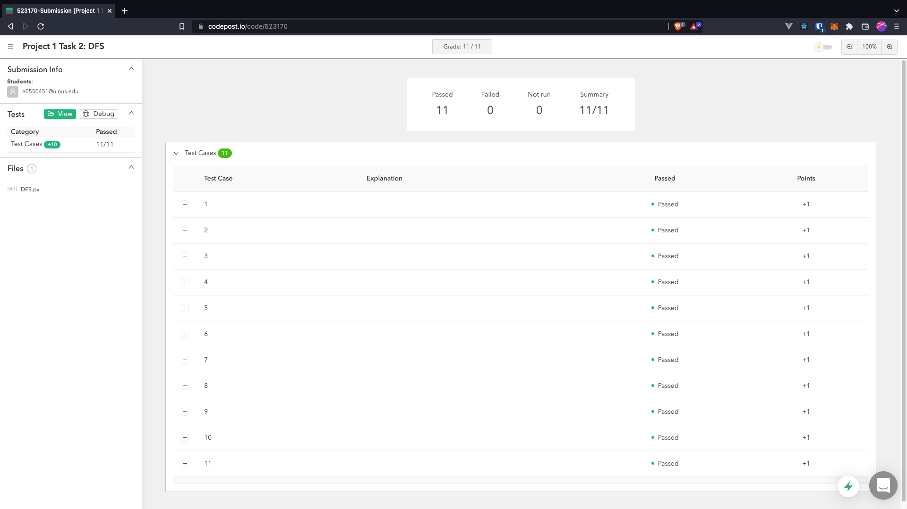
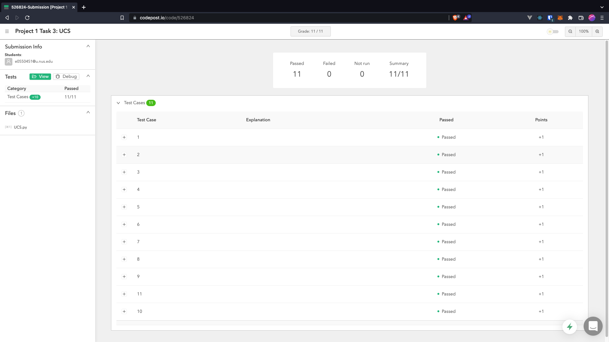
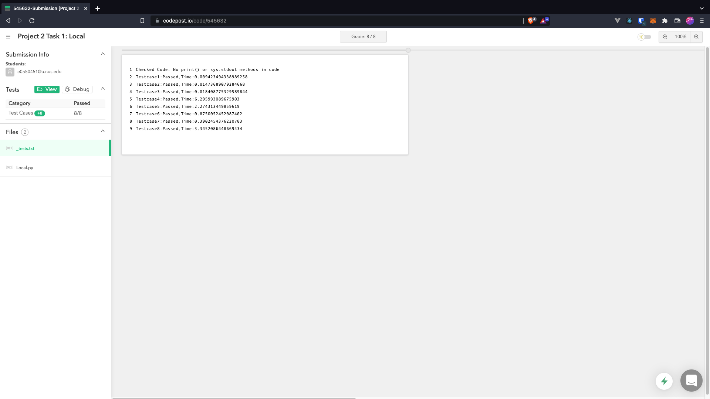
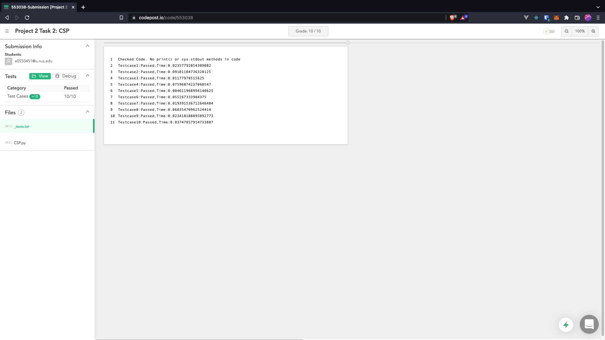
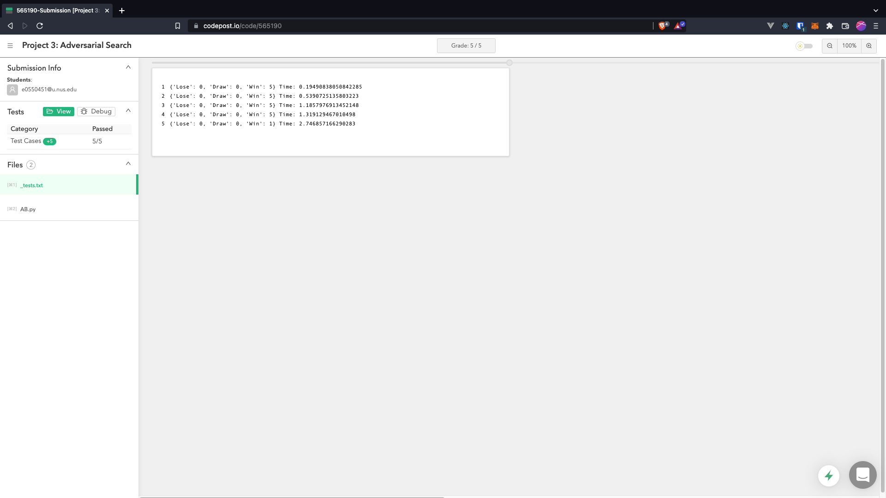

# CS3243-Projects
A repository of my solutions for CS3243 - Introduction to Artificial Intelligence project assignments. Passes all test cases on codePost.

## Project 1
Project 1's task is to apply classic search algorithms (BFS, DFS, UCS/Dijkstra's, A*) on a fun chess puzzle: the King's Maze. 
The algorithm's implementation is pretty straightforward, you can find a million articles on each of them just by Googling and reading up AIMA 4th edition.
The difficult part was parsing the test cases then setting up the data structures, and wrestling with the Python 
(I'm most comfortable with C-like statically-typed languages; programming without types scares me).

**Thoughts:**

While solving `BFS.py`, I fell into the OOP trap and hardly made any progress for a couple of days before I eventually got it to work. 
I was too worried about imaginary problems such as "code maintainability" and "code extensibility" that it distracted me from the main task: 
implement the damn algorithm! For `DFS.py`, I just copied my solution from BFS and changed the frontier from a queue to a stack. Since I value my time, I could 
not bother with OOP anymore, proceeded to break every principle and made everything a global state (sorry Uncle Bob), and managed to solve UCS and A* 
– which included debugging with cryptid feedback on codePost within 2 hours, hence this should explain why there's such a difference in the programming
styles between the Python files.

**codePost results:**

## Project 2
Task 1: Playing chess again but now its on applying local search! My approach to solving this problem was to model the relationship between the chess 
pieces as an undirected graph (credits to [Russell](https://github.com/RussellDash332) for the idea), and the aim is to remove certain number of 
vertices such that all the edges in the graph are removed. The algorithm I used was beam search with random restart. It definitely struggled for 
large testcases, but by introducing randomness in the mix, it was able to perform under 6 seconds at best on some runs. The tricky part was to find a 
suitable beam size, and I found that a beam size of k where k is the minimum number of pieces left on the board performed reasonably well. Although 
I am happy that it finally passes all the testcases, I can't justify spending 2 weeks on this task alone. This sucks.

**codePost results:**

Task 2: Playing chess again but now its on applying CSP/backtracking. Tried to use AC-3 but it was too slow, so I just relied on forward checking to 
knock out the domains. Turns out, forward checking is actually quite efficient! Some other optimisation tricks I used were:
* Memoisation
  * To avoid recomputing each pieces threat on every position on the board, I used a Dict to store all the computed piece threats since it does not 
    change.
* Most restricted variable heuristic
  * Simply by assigning the piece with the least number of occupiable positions first.
* Least restricted value heuristic
  * By enforcing the order of piece checking to follow Queen -> Bishop -> Rook -> Knight -> King.
* Random position assignment
  * Randomness to the rescue!

Unlike local search, CSP was much more manageable. All of my testcases have runtimes under 0.1 seconds, so that makes me a very happy man indeed.

**codePost results:**

## Project 3
TODO

Win rates:

Bot 1: 100%

Bot 2: 100%

Bot 3: 96%

Bot 4: 100%

Bot 5: 100%

**codePost results:**

## Disclaimer
I did not come up with the projects and tasks - they are the result of the hard work by the staff supporting and teaching this module.

## Warning
My Python skills are pretty cringe at the moment, so please bear with all the paranoid type annotations.
